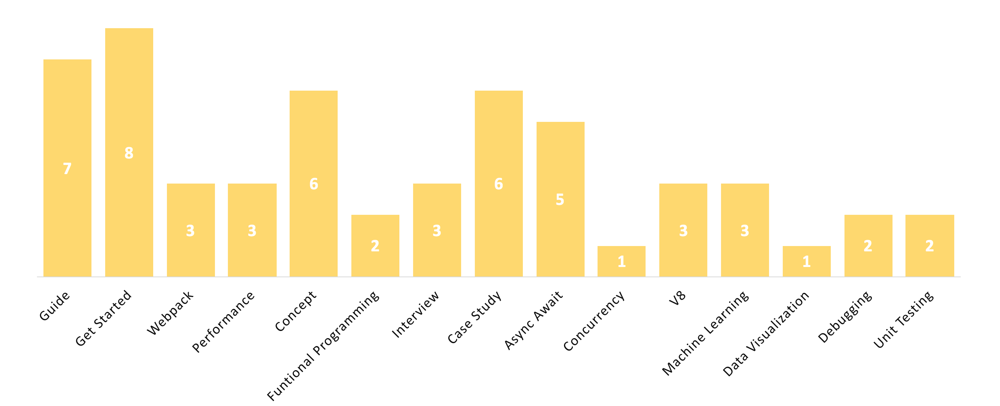

# 从过去一年最好的文章中学习原生 JavaScript

</a>

在2017年1月至12月之间，我们对比了近24000篇 JavaScript 文章，并从中挑选出了最好的55篇。

我们做了这个目录，认为阅读有经验的程序员写的文章是一个很好的学习方式。在学习了一两门课程之后，您可能在构建和发布实际应用时面临许多挑战。

通过这个目录，您可以更轻松地找到去年的最佳 JavaScript 教程，在这里有经验的开发人员会分享他们学习 JavaScript 的课程、见解和遇到的错误。

这个目录有15个关键的主题，如下所示。

</a>

如果你想查看带图片的版本：[查看 Medium 链接](https://goo.gl/jXpP4H)

 

## 目录
1. [指南](#指南)
1. [上手](#上手)
1. [Webpack](#webpack)
1. [性能](#性能)
1. [概念](#概念)
1. [函数式编程](#函数式编程)
1. [面试](#面试)
1. [教程案例](#教程案例)
1. [Async Await](#async-await)
1. [并发](#并发)
1. [V8](#v8)
1. [机器学习](#机器学习)
1. [数据可视化](#数据可视化)
1. [调试](#调试)
1. [单元测试](#单元测试)

 

### 推荐学习

A) 新手：[适合初学者的现代 JavaScript：学习并使用原生 JavaScript 构建项目（无框架或库）。](http://bit.ly/2E3RHNo)
4,995 推荐，4.8/5 星

B) 高级：[高级 JavaScript：成为一名高级 JS 开发者。包括面试问题以及实践。](http://bit.ly/2Gc2mGb) 
10,015 推荐，4.6/5 星

 

###  指南
* [Modern-js-cheatsheet: 一份针对现代项目中经常遇到的 JavaScript 知识的备忘清单。](https://github.com/mbeaudru/modern-js-cheatsheet?utm_source=mybridge&utm_medium=email&utm_campaign=read_more)
* [不同著名的计算机科学算法的 JavaScript 实现。](https://mgechev.github.io/javascript-algorithms/?utm_source=mybridge&utm_medium=email&utm_campaign=read_more)
* [30-seconds-of-code: 有用的 JavaScript 代码片段，你可以在30秒或更少的时间内理解。](https://github.com/Chalarangelo/30-seconds-of-code?utm_source=mybridge&utm_medium=email&utm_campaign=read_more)
* [一个简单的交互式 ES6 功能列表](https://codetower.github.io/es6-features?utm_source=mybridge&utm_medium=email&utm_campaign=read_more)
* [去他*的 JavaScript：有趣和棘手的 JavaScript 示例列表](https://github.com/denysdovhan/wtfjs?utm_source=mybridge&utm_medium=email&utm_campaign=read_more)
* [Airbnb 的 Javascript 风格指南](https://github.com/airbnb/javascript?utm_source=mybridge&utm_medium=email&utm_campaign=read_more)
* [JavaScript. 核心内容：第二版 - Dmitry Soshnikov](http://dmitrysoshnikov.com/ecmascript/javascript-the-core-2nd-edition?utm_source=mybridge&utm_medium=email&utm_campaign=read_more)
 

###  上手
* [萌新也能懂的现代 JavaScript 开发](https://medium.com/@peterxjang/modern-javascript-explained-for-dinosaurs-f695e9747b70?utm_source=mybridge&utm_medium=email&utm_campaign=read_more)
* [为远古 Web 开发者准备的的现代 JavaScript](https://trackchanges.postlight.com/modern-javascript-for-ancient-web-developers-58e7cae050f9?utm_source=mybridge&utm_medium=email&utm_campaign=read_more)
* [2017年的 JavaScript 模式 - Scott Allen](https://www.youtube.com/watch?v=hO7mzO83N1Q?utm_source=mybridge&utm_medium=email&utm_campaign=read_more)
* [为新手准备的带示例的 ES6](https://dev.to/srebalaji/es6-for-beginners-with-example-c7?utm_source=mybridge&utm_medium=email&utm_campaign=read_more)
* [当我没有关注时，JavaScript 变得更好了](https://eev.ee/blog/2017/10/07/javascript-got-better-while-i-wasnt-looking?utm_source=mybridge&utm_medium=email&utm_campaign=read_more)
* [我刚问过 23,000 个开发人员对 JavaScript 的看法。这是我学到的。](https://medium.freecodecamp.org/i-just-asked-23-000-developers-what-they-think-of-javascript-heres-what-i-learned-9a06b61998fa?utm_source=mybridge&utm_medium=email&utm_campaign=read_more)
* [我是如何在抛弃 JavaScript 90%的内容后，又重新找回对他的热爱的。](https://hackernoon.com/how-i-rediscovered-my-love-for-javascript-after-throwing-90-of-it-in-the-trash-f1baed075d1b?utm_source=mybridge&utm_medium=email&utm_campaign=read_more)
* [Vanilla JavaScript 中的 DOM 操作基础（无 jQuery） - SitePoint](https://www.sitepoint.com/dom-manipulation-vanilla-javascript-no-jquery?utm_source=mybridge&utm_medium=email&utm_campaign=read_more)
 

###  Webpack
* [一篇 Webpack 的详细介绍 – Smashing Magazine](https://www.smashingmagazine.com/2017/02/a-detailed-introduction-to-webpack?utm_source=mybridge&utm_medium=email&utm_campaign=read_more)
* [我维护 webpack，尽情向我提问！](https://dev.to/thelarkinn/i-maintain-webpack-ask-me-anything-an8?utm_source=mybridge&utm_medium=email&utm_campaign=read_more)
* [webpack bits: 充分利用 CommonsChunkPlugin()](https://medium.com/webpack/webpack-bits-getting-the-most-out-of-the-commonschunkplugin-ab389e5f318?utm_source=mybridge&utm_medium=email&utm_campaign=read_more)
 

###  性能
* [JavaScript 的代价 - Addy Osmani](https://medium.com/dev-channel/the-cost-of-javascript-84009f51e99e?utm_source=mybridge&utm_medium=email&utm_campaign=read_more)
* [JavaScript 气动性能 - Addy Osmani](https://medium.com/@addyosmani/javascript-start-up-performance-69200f43b201?utm_source=mybridge&utm_medium=email&utm_campaign=read_more)
* [JavaScript 是如何工作的：内存管理 + 如何处理四种常见的内存泄漏](https://blog.sessionstack.com/how-javascript-works-memory-management-how-to-handle-4-common-memory-leaks-3f28b94cfbec?utm_source=mybridge&utm_medium=email&utm_campaign=read_more)
 

###  概念
* [理解 JavaScript 中的作用域](https://scotch.io/tutorials/understanding-scope-in-javascript?utm_source=mybridge&utm_medium=email&utm_campaign=read_more)
* [现代 JavaScript 概念词汇表：第一部分](https://auth0.com/blog/glossary-of-modern-javascript-concepts?utm_source=mybridge&utm_medium=email&utm_campaign=read_more)
* [在 JavaScript 中处理 undefined 的7个技巧 - Dmitri Pavlutin‏](https://rainsoft.io/7-tips-to-handle-undefined-in-javascript?utm_source=mybridge&utm_medium=email&utm_campaign=read_more)
* [深入浅出编程概念](https://medium.freecodecamp.org/hard-coding-concepts-explained-with-simple-real-life-analogies-280635e98e37?utm_source=mybridge&utm_medium=email&utm_campaign=read_more)
* [在汉堡排队中解释 JavaScript 中的 Promise](http://kosamari.com/notes/the-promise-of-a-burger-party?utm_source=mybridge&utm_medium=email&utm_campaign=read_more)
* [编程技巧：尝试不用 If 语句编程 – Samer Buna](https://medium.com/@samerbuna/coding-tip-try-to-code-without-if-statements-d06799eed231?utm_source=mybridge&utm_medium=email&utm_campaign=read_more)
 

###  函数式编程
* [精通 JavaScript 面试：什么是函数式编程？](https://medium.com/javascript-scene/master-the-javascript-interview-what-is-functional-programming-7f218c68b3a0?utm_source=mybridge&utm_medium=email&utm_campaign=read_more)
* [函数式编程（编写软件）的兴起与衰落](https://medium.com/javascript-scene/the-rise-and-fall-and-rise-of-functional-programming-composable-software-c2d91b424c8c?utm_source=mybridge&utm_medium=email&utm_campaign=read_more)
 

###  面试
* [为开发者面试准备的最终版 JavaScript Handbook](https://medium.freecodecamp.org/the-definitive-javascript-handbook-for-a-developer-interview-44ffc6aeb54e?utm_source=mybridge&utm_medium=email&utm_campaign=read_more)
* [JavaScript 面试最常见的十个问题](https://www.youtube.com/watch?v=oxoFVqetl1E?utm_source=mybridge&utm_medium=email&utm_campaign=read_more)
* [面试中你必须知道的10个 JavaScript 概念](https://dev.to/arnavaggarwal/10-javascript-concepts-you-need-to-know-for-interviews?utm_source=mybridge&utm_medium=email&utm_campaign=read_more)
 

###  教程案例
* [在4分30秒内编写“贪吃蛇”（使用纯浏览器端 JavaScript）](https://www.youtube.com/watch?v=xGmXxpIj6vs?utm_source=mybridge&utm_medium=email&utm_campaign=read_more)
* [我们是如何在三周内开发出我们的第一个全栈 JavaScript web app 的](https://medium.com/ladies-storm-hackathons/how-we-built-our-first-full-stack-javascript-web-app-in-three-weeks-8a4668dbd67c?utm_source=mybridge&utm_medium=email&utm_campaign=read_more)
* [开发一个 Thrones Map 互动游戏（第二部分） - Leaflet.js 和 Webpack](https://blog.patricktriest.com/game-of-thrones-leaflet-webpack?utm_source=mybridge&utm_medium=email&utm_campaign=read_more)
* [使用 Javascript 创建一个区块链（区块链，第一部分）](https://www.youtube.com/watch?v=zVqczFZr124?utm_source=mybridge&utm_medium=email&utm_campaign=read_more)
* [我们是如何使用 JavaScript 黑掉咖啡机的](https://moin.world/2017/04/01/how-we-hacked-our-coffee-machine-with-javascript?utm_source=mybridge&utm_medium=email&utm_campaign=read_more)
* [Google 地图 JavaScript API 教程](https://www.youtube.com/watch?v=Zxf1mnP5zcw?utm_source=mybridge&utm_medium=email&utm_campaign=read_more)
 

###  Async Await
* [六个为什么 JavaScript 中的 Async/Await 完虐 Promise 的原因（教程）](https://medium.com/@mgaafar/6-reasons-why-javascripts-async-await-blows-promises-away-tutorial-c7ec10518dd9?utm_source=mybridge&utm_medium=email&utm_campaign=read_more)
* [Async/Await: JavaScript 中的现代并发](https://www.youtube.com/watch?v=NsQ2QIrQShU?utm_source=mybridge&utm_medium=email&utm_campaign=read_more)
* [JavaScript 是如何工作的：事件循环机制和异步编程的兴起 + 更好使用 async/await 编程的五种方式](https://blog.sessionstack.com/how-javascript-works-event-loop-and-the-rise-of-async-programming-5-ways-to-better-coding-with-2f077c4438b5?utm_source=mybridge&utm_medium=email&utm_campaign=read_more)
* [JavaScript 中的 async / await - What, Why and How - Fun Fun Function](https://www.youtube.com/watch?v=568g8hxJJp4?utm_source=mybridge&utm_medium=email&utm_campaign=read_more)
* [图文并茂的解释 Await 和 Async](http://nikgrozev.com/2017/10/01/async-await?utm_source=mybridge&utm_medium=email&utm_campaign=read_more)
 

###  并发
* [并发JavaScript：可以工作！](https://webkit.org/blog/7846/concurrent-javascript-it-can-work?utm_source=mybridge&utm_medium=email&utm_campaign=read_more)
 

###  V8
* [JavaScript 是如何工作的：V8 引擎内部机制及如何编写优化代码的 5 个诀窍](https://blog.sessionstack.com/how-javascript-works-inside-the-v8-engine-5-tips-on-how-to-write-optimized-code-ac089e62b12e?utm_source=mybridge&utm_medium=email&utm_campaign=read_more)
* [理解 V8 的字节码](https://medium.com/dailyjs/understanding-v8s-bytecode-317d46c94775?utm_source=mybridge&utm_medium=email&utm_campaign=read_more)
* [JavaScript 是如何工作的：引擎，运行时以及调用堆栈概览](https://blog.sessionstack.com/how-does-javascript-actually-work-part-1-b0bacc073cf?utm_source=mybridge&utm_medium=email&utm_campaign=read_more)
 

###  机器学习
* [使用 deeplearn.js 尝试 JavaScript 中的神经网络](https://www.robinwieruch.de/neural-networks-deeplearnjs-javascript?utm_source=mybridge&utm_medium=email&utm_campaign=read_more)
* [如何只用30行代码在 JavaScript 中构建一个神经网络](https://medium.freecodecamp.org/how-to-create-a-neural-network-in-javascript-in-only-30-lines-of-code-343dafc50d49?utm_source=mybridge&utm_medium=email&utm_campaign=read_more)
* [在 JavaScript 使用机器学习：第一部分](https://hackernoon.com/machine-learning-with-javascript-part-1-9b97f3ed4fe5?utm_source=mybridge&utm_medium=email&utm_campaign=read_more)
 

###  数据可视化
* [更好的编程方式：d3.express 介绍：集成的探索环境。](https://medium.com/@mbostock/a-better-way-to-code-2b1d2876a3a0?utm_source=mybridge&utm_medium=email&utm_campaign=read_more)
 

###  调试
* [你可能不知道的14个 JavaScript 调试技巧](https://raygun.com/javascript-debugging-tips?utm_source=mybridge&utm_medium=email&utm_campaign=read_more)
* [如何充分利用 JavaScript 控制台](https://medium.freecodecamp.org/how-to-get-the-most-out-of-the-javascript-console-b57ca9db3e6d?utm_source=mybridge&utm_medium=email&utm_campaign=read_more)
 

###  单元测试
* [JavaScript中的单元测试[第1部分]：为什么要进行单元测试？ - Fun Fun Function](https://www.youtube.com/watch?v=Eu35xM76kKY?utm_source=mybridge&utm_medium=email&utm_campaign=read_more)
* [2017年 JavaScript 测试技术回顾](https://medium.com/powtoon-engineering/a-complete-guide-to-testing-javascript-in-2017-a217b4cd5a2a?utm_source=mybridge&utm_medium=email&utm_campaign=read_more)
